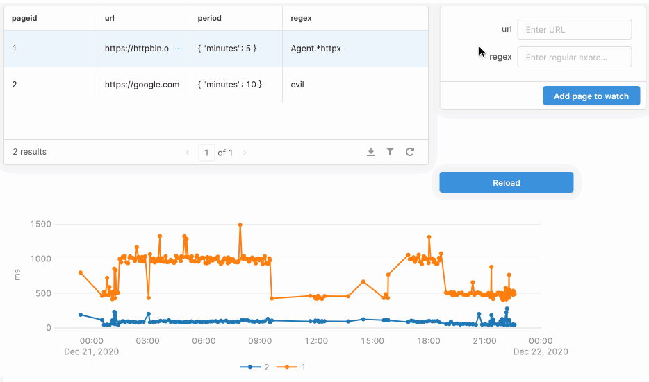

# sitewatch



**(The UI above was quickly made in [Retool](https://retool.com/), drag-and-drop build-your-own-admin-UI service.)**

`sitewatch` is an experiment to play with:

- [Google Cloud](https://cloud.google.com/): [Containers on Compute Engine](https://cloud.google.com/compute/docs/containers)
- [GitHub Actions](https://github.com/features/actions)
- [Aiven](https://aiven.io)
- [Trio](https://trio.readthedocs.io/): Python library for async concurrency
- [Kafka](https://kafka.apache.org/)
- [Posgres](https://www.postgresql.org/): LISTEN/NOTIFY
- [Retool](https://retool.com/): quickly build admin UI

It's also a template for a Python daemon running on Google Cloud.

## Start hacking

Prerequisites:

* Python 3.9
* [poetry](https://python-poetry.org/docs/#installation)
* Docker
* [Google Cloud SDK](https://cloud.google.com/sdk/docs/install)
* [jq](https://stedolan.github.io/jq/)
* Aiven project with Kafka and Postgres running

Setup:
```
poetry env use python3.9
poetry install
```

Load Aiven credentials and service URIs to `.env/` (replace `pg-123456` and `kafka-123456` with correct service names in Aiven):
```
poetry run avn user login
./save-aiven-creds pg-123456 kafka-123456
```

Start services directly:
```
./start watch
./start report
```

Build and start services via Docker container:
```
./docker-start watch
./docker-start report
```

Lint and test:
```
./lint && ./test
```

To update test snapshots (in case of "snapshots failed" error):
```
./test.sh --snapshot-update
```

Format code with [black](https://github.com/ambv/black):
```
./format
```

## Deploy

Dependencies:

* [Aiven](https://aiven.io): Kafka and Postgres
* Google Cloud: [Containers](https://cloud.google.com/compute/docs/containers)

Service is automatically deployed on each commit to `main` branch via GitHub Actions [deploy.yml](.github/workflows/deploy.yml) workflow. The workflow requires the following repository secrets to be defined:

| Secret name | Description |
| --- | --- |
| `AIVEN_TOKEN` | Aiven API token |
| `AIVEN_EMAIL` | Aiven user email |
| `AIVEN_PROJECT` | Aiven project name, e.g. `project-12345` |
| `AIVEN_PG_SERVICE` | Aiven Postgres service name, e.g. `pg-123456` |
| `AIVEN_KAFKA_SERVICE` | Aiven Kafka service name, e.g. `kafka-123456`. Should have `report-topic` topic. |
| `GCP_PROJECT` | Google Cloud project name |
| `GCP_SA_KEY` | Google Cloud service account key, see `deploy.yml` for details. |

Getting `AIVEN_TOKEN`:
```
poetry run avn user access-token create --description 'google cloud container' --json | jq -r '.[0].full_token'
```

## View container logs on Compute Engine

```
gcloud init
./logs watch
./logs report
```
